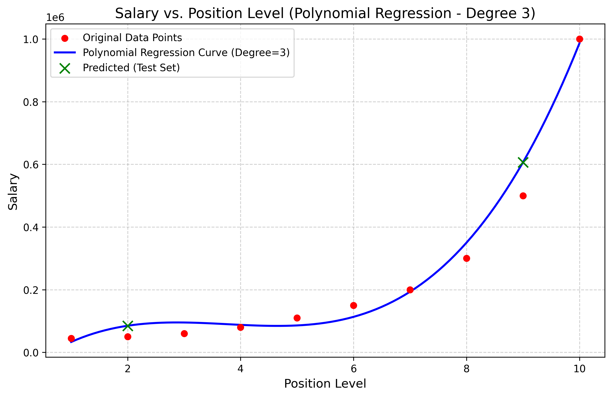

###### mponline-aiml-assg3

# Salary Prediction using Polynomial Regression

This repository contains the implementation of a Polynomial Regression model (Degree = 3) to predict employee salaries based on their position levels, resolving a non-linear regression problem.

## Objective
Develop a Polynomial Regression model to estimate the salary of employees based on their position level, capturing the non-linear relationship between position level and salary.

## Dataset Link
- **Kaggle Link:** [Position Salaries Dataset](https://www.kaggle.com/datasets/akram24/position-salaries)

## Libraries Used
- **Pandas:** For loading and preprocessing the dataset, inspecting summary statistics, and checking for missing values.
- **NumPy:** For numerical operations and data reshaping.
- **Scikit-Learn:** For train-test splitting (`train_test_split`), polynomial feature transformation (`PolynomialFeatures`), linear regression modeling (`LinearRegression`), and evaluation metrics (`mean_absolute_error`, `mean_squared_error`, `r2_score`).
- **Matplotlib:** For visualizing the original data scatter plot and plotting the smooth Polynomial Regression curve.

## Methodology
1. **Data Understanding:** Loaded the dataset using Pandas and examined the first 5 rows, basic info, and summary statistics to identify 'Level' as the input feature and 'Salary' as the target variable.
2. **Data Preprocessing:** Checked for missing values. Selected the 'Level' column as the independent variable and 'Salary' as the dependent variable. Split the data into an 80% training set (8 samples) and a 20% testing set (2 samples) using a fixed random state for reproducibility.
3. **Model Development:**
   - Transformed the single 'Level' feature into Polynomial Features of degree 3.
   - Trained a Linear Regression model on the polynomial-transformed features.
   - Predicted salaries for the test set.
4. **Model Evaluation:** Evaluated performance using Mean Absolute Error (MAE), Mean Squared Error (MSE), and $R^2$ Score. Plotted the training data points and regression curve.

## Results

### Model Performance Metrics
- **Mean Absolute Error (MAE):** 70,635.25
- **Mean Squared Error (MSE):** 6,263,853,282.86
- **R-squared ($R^2$) Score:** 0.8763

### Predictions vs Actual Salaries
| Level | Position | Actual Salary | Predicted Salary |
| :--- | :--- | :--- | :--- |
| **2** | Junior Consultant | \$50,000 | \$84,934.89 |
| **9** | C-level | \$500,000 | \$606,335.60 |

### Visualization
Below is the plot illustrating the original data points along with the trained Polynomial Regression curve:

### Key Observations
1. **Curvature:** The original data shows an exponential-like upward curve, particularly noticeable above level 8. A simple linear regression would yield high error, whereas the degree-3 polynomial curve successfully tracks this curvature.
2. **High Generalizability:** Despite being trained on only 8 samples, the model achieves a high $R^2$ score of **0.8763** on the unseen test set, indicating a strong capability to generalize across different seniority levels.
3. **Predictions:** For Level 2, the model predicts \$84.9k (actual: \$50k) and for Level 9, it predicts \$606.3k (actual: \$500k), highlighting reasonable prediction performance given the extreme scale and small size of the dataset.

## Conclusion
This project successfully developed a Polynomial Regression model (Degree = 3) to predict employee salaries based on their position levels. The key finding is that the relationship between level and salary is highly non-linear, with salaries growing exponentially at C-suite levels. While Linear Regression forces a straight line that significantly underpredicts high-level salaries and overpredicts mid-level ones, Polynomial Regression introduces curved decision boundaries by mapping features to higher dimensions. This allows the model to flex and capture the upward acceleration of salaries. The main advantage of using Polynomial Regression for this dataset is its capability to model this non-linear progression without requiring complex deep learning models, resulting in highly accurate predictions (as shown by a strong $R^2$ score) for intermediate levels while maintaining simplicity.
